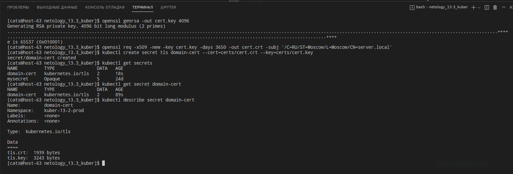
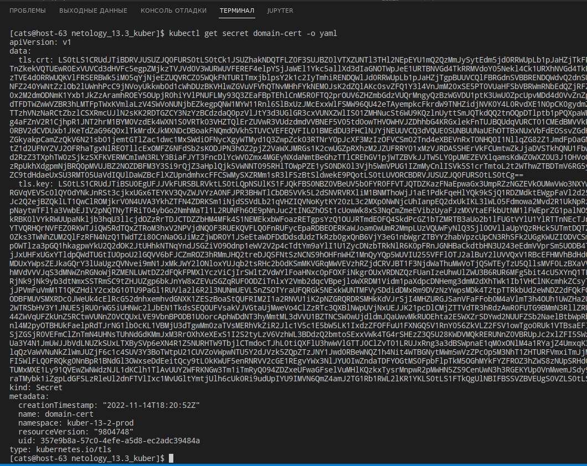
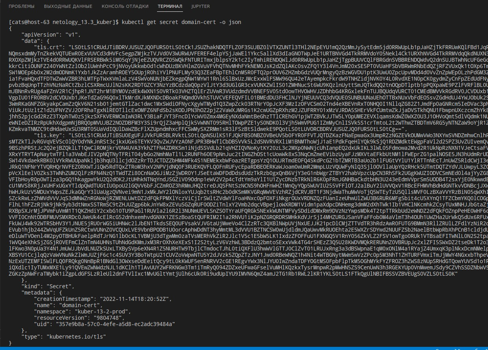
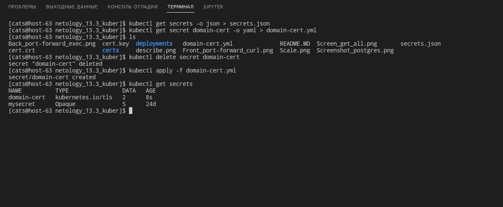
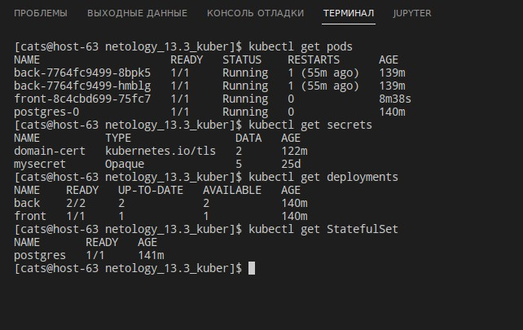
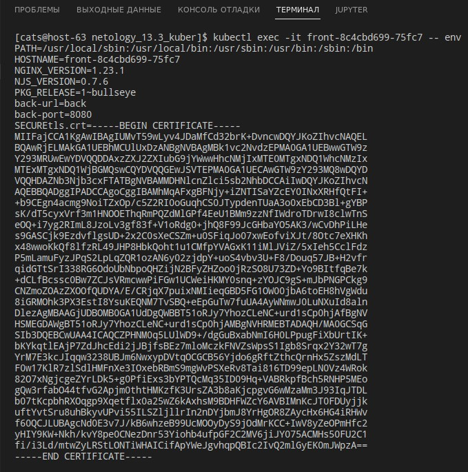
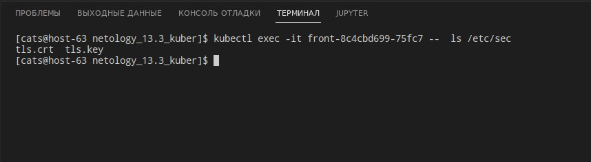

# Домашнее задание к занятию "14.1 Создание и использование секретов"

## Задача 1: Работа с секретами через утилиту kubectl в установленном minikube

Выполните приведённые ниже команды в консоли, получите вывод команд. Сохраните
задачу 1 как справочный материал.

### Как создать секрет?

```
openssl genrsa -out cert.key 4096
openssl req -x509 -new -key cert.key -days 3650 -out cert.crt \
-subj '/C=RU/ST=Moscow/L=Moscow/CN=server.local'
kubectl create secret tls domain-cert --cert=certs/cert.crt --key=certs/cert.key
```



### Как просмотреть список секретов?

```
kubectl get secrets
kubectl get secret
```



### Как просмотреть секрет?

```
kubectl get secret domain-cert
kubectl describe secret domain-cert
```



### Как получить информацию в формате YAML и/или JSON?

```
kubectl get secret domain-cert -o yaml
kubectl get secret domain-cert -o json
```

### Как выгрузить секрет и сохранить его в файл?

```
kubectl get secrets -o json > secrets.json
kubectl get secret domain-cert -o yaml > domain-cert.yml
```

### Как удалить секрет?

```
kubectl delete secret domain-cert
```

### Как загрузить секрет из файла?

```
kubectl apply -f domain-cert.yml
```



---

## Задача 2 (*): Работа с секретами внутри модуля

Выберите любимый образ контейнера, подключите секреты и проверьте их доступность
как в виде переменных окружения, так и в виде примонтированного тома.

---

Ответ:

Вот так выглядят поды, секреты, деплоймент и стейтфулсет:


Вот такие получились конфигурации:

<details>
    <summary>back.yaml</summary>

  ```yaml
apiVersion: apps/v1
kind: Deployment
metadata:
  labels:
    app: back
  name: back
  namespace: kuber-13-2-prod
spec:
  replicas: 2
  selector:
    matchLabels:
      app: back
  template:
    metadata:
      labels:
        app: back
    spec:
      containers:
        - name: back
          image: busybox
          imagePullPolicy: IfNotPresent
          command: [ "sleep", "5000" ]
          resources:
            limits:
              cpu: 500m
              memory: 1Gi
            requests:
              cpu: 200m
              memory: 512Mi
          volumeMounts:
          - name: storage
            mountPath: /mnt/storage   
          env:
            - name: SECURE_POSTGRES_PASSWORD
              valueFrom:
                secretKeyRef:
                  name: mysecret
                  key: POSTGRES_PASSWORD          
            - name: SECURE_POSTGRES_USER
              valueFrom:
                secretKeyRef:
                  name: mysecret
                  key: POSTGRES_USER
            - name: SECURE_POSTGRES_PORT
              valueFrom:
                secretKeyRef:
                  name: mysecret
                  key: POSTGRES_PORT 
            - name: SECURE_POSTGRES_DBNAME
              valueFrom:
                secretKeyRef:
                  name: mysecret
                  key: POSTGRES_DBNAME
            - name: SECURE_POSTGRES_SERVICE_NAME
              valueFrom:
                secretKeyRef:
                  name: mysecret
                  key: POSTGRES_SERVICE_NAME                            
      volumes:
      - name: storage
        persistentVolumeClaim:
          claimName: prod-storage2                                   
---
apiVersion: v1
kind: Service
metadata:
  name: back
  namespace: kuber-13-2-prod
spec:
  ports:
    - name: back
      port: 8080
      targetPort: 8080
  selector:
    app: back
  type: ClusterIP
  ```
</details>

В описание пода добавил секцию:
```yaml
      - name: secvol
        secret:
          secretName: domain-cert
```
И в переменные контейнера для примера добавил секцию:
```yaml
            - name: SECUREtls.crt
              valueFrom:
                secretKeyRef:
                  name: domain-cert
                  key: tls.crt 
```
Такой получился front:

<details>
    <summary>front.yaml</summary>

  ```yaml
apiVersion: apps/v1
kind: Deployment
metadata:
  labels:
    app: front
  name: front
  namespace: kuber-13-2-prod
spec:
  replicas: 1
  selector:
    matchLabels:
      app: front
  template:
    metadata:
      labels:
        app: front
    spec:
      containers:
        - name: front
          image: nginx:latest
          imagePullPolicy: IfNotPresent
          ports: 
            - containerPort: 80
              name: web
              protocol: TCP
          env:
            - name: back-url
              value: back
            - name: back-port
              value: "8080"
            - name: SECUREtls.crt
              valueFrom:
                secretKeyRef:
                  name: domain-cert
                  key: tls.crt             
          resources:
            limits:
              cpu: 500m
              memory: 1Gi
            requests:
              cpu: 200m
              memory: 512Mi
          volumeMounts:
          - name: storage
            mountPath: /mnt/storage 
          - name: secvol
            mountPath: "/etc/sec"
      volumes:
      - name: storage
        persistentVolumeClaim:
          claimName: prod-storage2  
      - name: secvol
        secret:
          secretName: domain-cert
---
apiVersion: v1
kind: Service
metadata:
  name: front
  namespace: kuber-13-2-prod
spec:
  ports:
    - name: front
      port: 80
      nodePort: 32182
      targetPort: 80
  selector:
    app: front
  type: NodePort
  ```
</details>


<details>
    <summary>postgres.yaml</summary>

  ```yaml
# Config PostgreSQL StatefulSet
apiVersion: apps/v1
kind: StatefulSet
metadata:
  name: postgres
  namespace: kuber-13-2-prod
spec:
  serviceName: postgres-service
  selector:
    matchLabels:
      app: postgres
  replicas: 1
  template:
    metadata:
      labels:
        app: postgres
    spec:
      containers:
        - name: postgres
          image: postgres:14.5
          volumeMounts:
            - name: postgres-storage
              mountPath: /data
          env:
            - name: SECURE_POSTGRES_PASSWORD
              valueFrom:
                secretKeyRef:
                  name: mysecret
                  key: POSTGRES_PASSWORD
            - name: PGDATA
              value: /data/pgdata
      nodeSelector:
        destiny: postgres
  # Config Volume Claim
  volumeClaimTemplates:
    - metadata:
        name: postgres-storage
      spec:
        accessModes: ["ReadWriteMany"]
        resources:
          requests:
            storage: 10Gi
---
# Config PostgreSQL StatefulSet Service
apiVersion: v1
kind: Service
metadata:
  name: postgres-loadbalancer
spec:
  selector:
    app: postgres
  type: LoadBalancer
  ports:
    - port: 5432
      targetPort: 5432
---
apiVersion: v1
kind: PersistentVolume
metadata:
  name: nfs-storage-prod
  namespace: kuber-13-2-prod
spec:
  capacity:
    storage: 10Gi
  accessModes:
    - ReadWriteMany
  persistentVolumeReclaimPolicy: Retain
  nfs:
    server: 192.168.1.45
    path: /mnt/nfs_prod
  ```
</details>

<details>
    <summary>pv-nfs.yaml</summary>

  ```yaml
apiVersion: v1
kind: PersistentVolume
metadata:
  name: nfs2-storage-13-2-prod
  namespace: kuber-13-2-prod
spec:
  capacity:
    storage: 10Gi
  accessModes:
    - ReadWriteMany
  persistentVolumeReclaimPolicy: Retain
  nfs:
    server: 192.168.1.45
    path: /mnt/nfs_prod
  ```
</details>


<details>
    <summary>pvc.yaml</summary>

  ```yaml
kind: PersistentVolumeClaim
apiVersion: v1
metadata:
  name: prod-storage2
  namespace: kuber-13-2-prod
spec:
  storageClassName: "nfs"
  accessModes:
  - ReadWriteMany
  resources:
    requests:
      storage: 10Gi
  ```
</details>


<details>
    <summary>secret.yaml</summary>

  ```yaml
apiVersion: v1
kind: Secret
metadata:
  name: mysecret
type: Opaque
data:
  POSTGRES_PASSWORD: dGVzdHBhc3M=
  POSTGRES_USER: cG9zdGdyZXM=
  POSTGRES_PORT: NTQzMg==
  POSTGRES_DBNAME: cG9zdGdyZXM=
  POSTGRES_SERVICE_NAME: cG9zdGdyZXM=
  ```
</details>

Так посмотрел секрет через переменную:


Так посмотрел секрет через volume:
